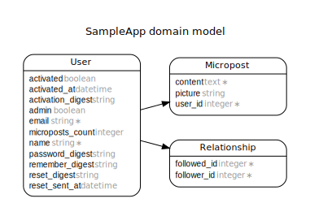

# Ruby on Rails Tutorial: sample application

This is the sample application for the [*Ruby on Rails Tutorial: Learn Web Development with Rails*](http://www.railstutorial.org/) by [Michael Hartl](http://www.michaelhartl.com/).

## Notes

### Routes
To generate annotated routes, run `annotate --routes -p after`

### Domain Model
Run `rake generate_erd` to regenerate (must have [graphviz installed](http://voormedia.github.io/rails-erd/install.html#install-graphviz)).

